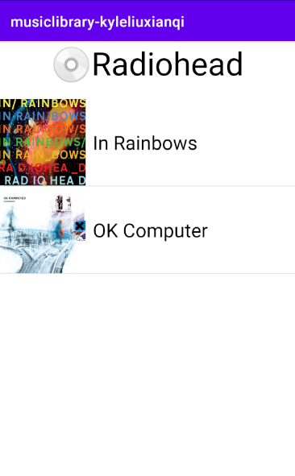

# musiclibrary-kyleliuxianqi
musiclibrary-kyleliuxianqi created by GitHub Classroom

Author: LIU Xianqi 61551

Project Structure:
1.Java: 
- I create 3 entities, which are Band, Album and Song. Band includes attributes which are name,
image, albums list. Album does the same, but the difference is that it has a songs list. The advantage 
by doing this is getting more convenient to get different band's albums and songs details.
- And I only read the CSV file once for storing the data for Band hashmap, then use getter and setter to
complete the entity for Album and Song. For passing the intent to start Album and Song activities, I 
use Serializable to serialize objects, then pass the object to another activity, and use getter function
to acquire the data.
- For defining and controlling the RecyclerView, I write different adapter for each RecyclerView.

2.Layout:

- In order using the RecyclerView, I create different item layout for each Recyclerview.

Demo Show:

1.Band Activity

-Display the Band with its name and picture
-Click different bands will start their Album activity.

2.Album Activity

-Display the Album with its name and picture
-Click different albums will start their Album activity.

3.Song Activity

-Display the Song with its name

